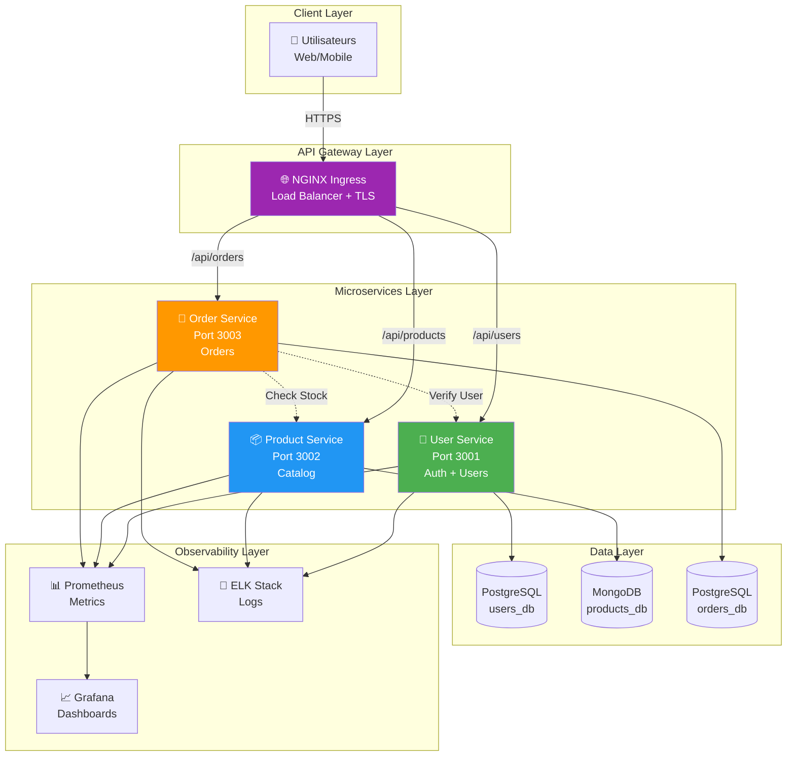
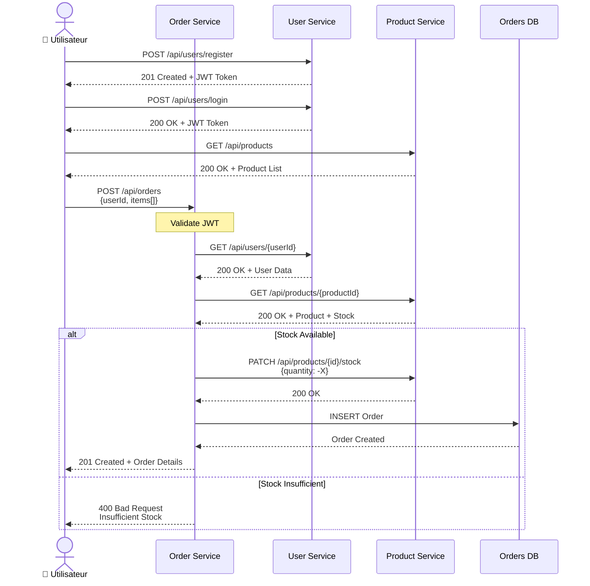
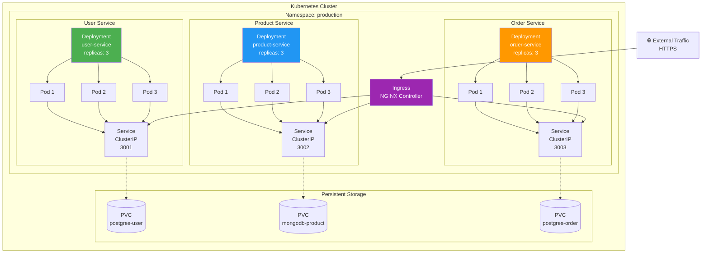
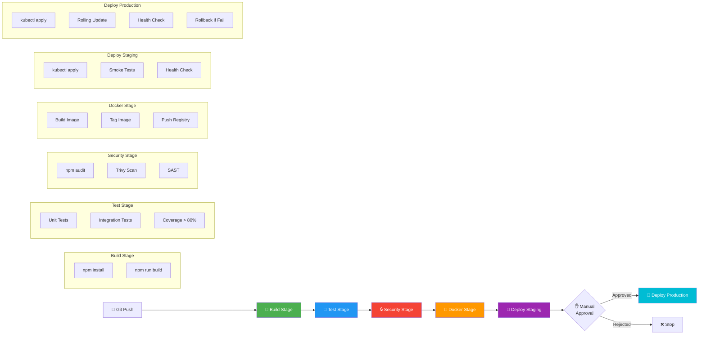
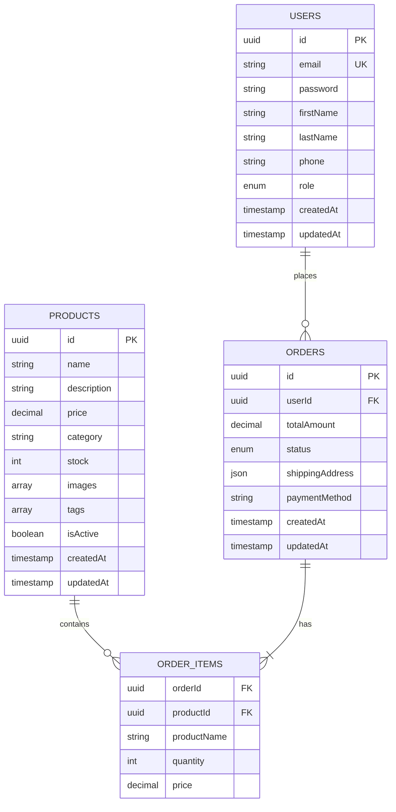

# ARCHITECTURE - E-Commerce Microservices

## 1. Architecture Globale

## 2. Diagramme de Séquence - Créer une Commande

## 3. Architecture Kubernetes

## 4. Pipeline CI/CD

## 5. Modèle de Données

---

**Document créé le** : 04 Janvier 2026  
**Version** : 1.0
