# ARCHITECTURE - E-Commerce Microservices

## 1. Architecture Globale

```mermaid
graph TB
    subgraph "Client Layer"
        U[👤 Utilisateurs<br/>Web/Mobile]
    end
    
    subgraph "API Gateway Layer"
        IG[🌐 NGINX Ingress<br/>Load Balancer + TLS]
    end
    
    subgraph "Microservices Layer"
        US[🔐 User Service<br/>Port 3001<br/>Auth + Users]
        PS[📦 Product Service<br/>Port 3002<br/>Catalog]
        OS[🛒 Order Service<br/>Port 3003<br/>Orders]
    end
    
    subgraph "Data Layer"
        UPDB[(PostgreSQL<br/>users_db)]
        PPDB[(MongoDB<br/>products_db)]
        OPDB[(PostgreSQL<br/>orders_db)]
    end
    
    subgraph "Observability Layer"
        PROM[📊 Prometheus<br/>Metrics]
        GRAF[📈 Grafana<br/>Dashboards]
        ELK[📝 ELK Stack<br/>Logs]
    end
    
    U -->|HTTPS| IG
    IG -->|/api/users| US
    IG -->|/api/products| PS
    IG -->|/api/orders| OS
    
    US --> UPDB
    PS --> PPDB
    OS --> OPDB
    
    OS -.->|Verify User| US
    OS -.->|Check Stock| PS
    
    US --> PROM
    PS --> PROM
    OS --> PROM
    PROM --> GRAF
    
    US --> ELK
    PS --> ELK
    OS --> ELK
    
    style US fill:#4CAF50,color:#fff
    style PS fill:#2196F3,color:#fff
    style OS fill:#FF9800,color:#fff
    style IG fill:#9C27B0,color:#fff
```

## 2. Diagramme de Séquence - Créer une Commande

## 3. Architecture Kubernetes

```mermaid
graph TB
    subgraph "Kubernetes Cluster"
        subgraph "Namespace: production"
            subgraph "User Service"
                USD[Deployment<br/>user-service<br/>replicas: 3]
                USP1[Pod 1]
                USP2[Pod 2]
                USP3[Pod 3]
                USS[Service<br/>ClusterIP<br/>3001]
            end
            
            subgraph "Product Service"
                PSD[Deployment<br/>product-service<br/>replicas: 3]
                PSP1[Pod 1]
                PSP2[Pod 2]
                PSP3[Pod 3]
                PSS[Service<br/>ClusterIP<br/>3002]
            end
            
            subgraph "Order Service"
                OSD[Deployment<br/>order-service<br/>replicas: 3]
                OSP1[Pod 1]
                OSP2[Pod 2]
                OSP3[Pod 3]
                OSS[Service<br/>ClusterIP<br/>3003]
            end
            
            ING[Ingress<br/>NGINX Controller]
            
            USD --> USP1 & USP2 & USP3
            USP1 & USP2 & USP3 --> USS
            
            PSD --> PSP1 & PSP2 & PSP3
            PSP1 & PSP2 & PSP3 --> PSS
            
            OSD --> OSP1 & OSP2 & OSP3
            OSP1 & OSP2 & OSP3 --> OSS
            
            ING --> USS & PSS & OSS
        end
        
        subgraph "Persistent Storage"
            PV1[(PVC<br/>postgres-user)]
            PV2[(PVC<br/>mongodb-product)]
            PV3[(PVC<br/>postgres-order)]
        end
        
        USS -.-> PV1
        PSS -.-> PV2
        OSS -.-> PV3
    end
    
    EXT[🌐 External Traffic<br/>HTTPS] --> ING
    
    style USD fill:#4CAF50,color:#fff
    style PSD fill:#2196F3,color:#fff
    style OSD fill:#FF9800,color:#fff
    style ING fill:#9C27B0,color:#fff
```

## 4. Pipeline CI/CD

```mermaid
graph LR
    A[📝 Git Push] --> B[🔨 Build Stage]
    B --> C[🧪 Test Stage]
    C --> D[🔒 Security Stage]
    D --> E[🐳 Docker Stage]
    E --> F[🚀 Deploy Staging]
    F --> G{✋ Manual<br/>Approval}
    G -->|Approved| H[🎯 Deploy Production]
    G -->|Rejected| I[❌ Stop]
    
    subgraph "Build Stage"
        B1[npm install]
        B2[npm run build]
    end
    
    subgraph "Test Stage"
        C1[Unit Tests]
        C2[Integration Tests]
        C3[Coverage > 80%]
    end
    
    subgraph "Security Stage"
        D1[npm audit]
        D2[Trivy Scan]
        D3[SAST]
    end
    
    subgraph "Docker Stage"
        E1[Build Image]
        E2[Tag Image]
        E3[Push Registry]
    end
    
    subgraph "Deploy Staging"
        F1[kubectl apply]
        F2[Smoke Tests]
        F3[Health Check]
    end
    
    subgraph "Deploy Production"
        H1[kubectl apply]
        H2[Rolling Update]
        H3[Health Check]
        H4[Rollback if Fail]
    end
    
    style B fill:#4CAF50,color:#fff
    style C fill:#2196F3,color:#fff
    style D fill:#F44336,color:#fff
    style E fill:#FF9800,color:#fff
    style F fill:#9C27B0,color:#fff
    style H fill:#00BCD4,color:#fff
```

## 5. Modèle de Données

---

**Document créé le** : 04 Janvier 2026  
**Version** : 1.0
